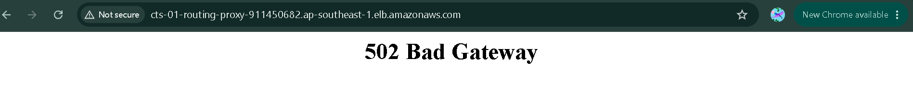
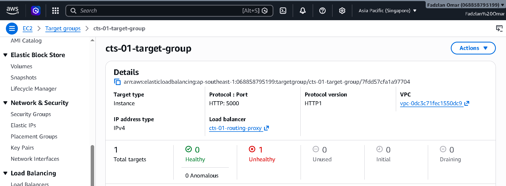
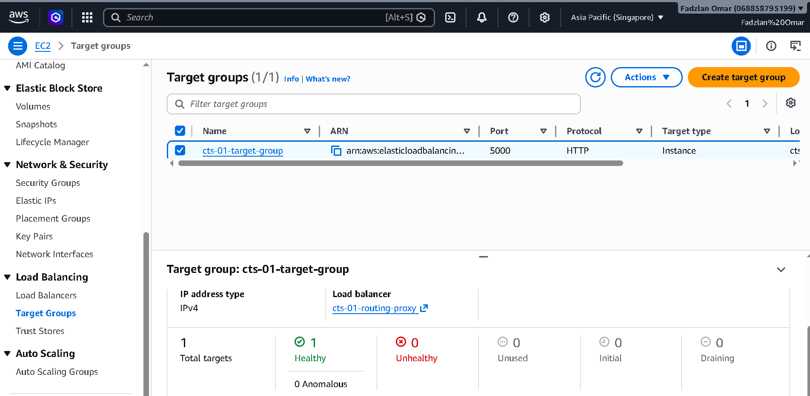

# CTS-01: ALB 502 Bad Gateway (Flask Process Failure)

Production incident simulation demonstrating how to investigate and recover an AWS Application

# Incident Summary

| Item | Details |
|------|---------|
| Incident ID | CTS-01 |
| Environment | Production Simulation |
| Severity | P1 - Critical |
| Service | Flask Web Application |
| Reported Issue | 502 Bad Gateway |
| Status | Resolved |
| Root Cause | Flask application process stopped |
| Recovery Time | ~15 Minutes |

---

# Project Objective

Simulate a real production outage where users are unable to access a web application through an Application Load Balancer.
The objective is to investigate the issue using AWS and Linux tools, identify the root cause, restore the application, and document the complete troubleshooting process.

# Architecture Layout

                  Internet
                     │
                     ▼
      Application Load Balancer (Port 80)
                     │
                     ▼
              Target Group
                     │
                     ▼
              EC2 Ubuntu Instance
                     │
             Flask Application
                Port 5000
---

# Phase 1: The Outage & Triage Timeline

## 1. Ingress Symptom
When visiting the Application Load Balancer URL, the edge proxy returned a definitive error:
- **Symptom:** \502 Bad Gateway\
- **Evidence Reference:**\'screenshots/502-bad-gateway-error.png\`
 
  
## 2. Target Group Audit
Opened the AWS Target Group and found that the EC2 instance was marked Unhealthy. This confirmed that the Application Load Balancer was working correctly, but it could not reach the Flask application running on the backend instance:
- **Status:** \unhealthy\
- **Reason:** \Target.Timeout\ (Health checks failing on Port 5000)
- **Evidence Reference:**
  

## 3. Compute Infrastructure Verification
Verified the core instance state via the AWS CLI/Console:
- **EC2 State:** \Running\
- **Conclusion:** The virtual machine was completely stable, indicating the failure was isolated to the internal networking layer or application runtime.

---

# Phase 2: Deep-Dive Linux Investigation

With the infrastructure verified as running, we initiated an internal systems audit via secure SSH tunnel to inspect the server internals.

## Investigation Process:
1. **Check whether the Flask application is running:** Checked for active python runtimes:
   \\\bash
   ps aux | grep python3
   \\\
   *Result:* No Flask process was running.This indicated that the application had stopped.

2. **Local Port Bind Verification:** Tested internal listener loopbacks:
   \\\bash
   curl localhost:5000
   \\\
   *Result:* \Failed to connect to localhost port 5000: Connection refused\.Since localhost could not reach port 5000,
    the issue was inside the EC2 instance rather than the ALB.

3. **Deployment Log Audit:** Verified that the startup initialization executed successfully without installation errors:
   \\\bash
   cat /var/log/cloud-init-output.log
   \\\
   *Result:* Dependencies installed correctly during system boot; process was killed post-deployment.

---

## Phase 3: Recovery Actions

### 1. Restore the application
Manually re-initialized the background daemon to restore immediate application delivery:
\\\bash
nohup python3 /home/ubuntu/app.py & > /home/ubuntu/app.log 
\\\

### 2. Confirm the fix
- Monitored the AWS Target Group until status transitioned back to **\healthy (1/1 targets)\**.

### 3. Final Verification
modify group of target health extended another port to port 22
- **Result:** Flask started successfully.The application became reachable again on port 5000
- **Evidence Reference:** \screenshots/cts-01-evidence-06-success-browser.png\
  

---

## Skills Demonstrated 
- Investigated a production-style 502 Bad Gateway incident.
- Verified ALB, Target Group, and EC2 health status.
- Used Linux commands to identify that the Flask process had stopped.
- Restored the application service manually.
- Validated recovery using AWS Target Groups and browser testing.
- Performed root cause analysis and documented the complete incident.

## Final Result
- Application recovered
- Target Group healthy
- ALB serving traffic successfully
- Production incident resolved
